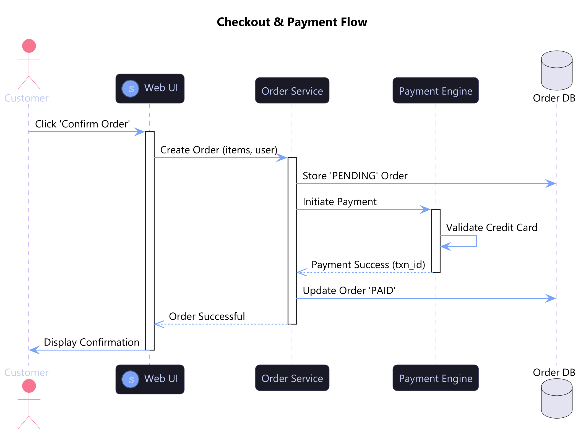
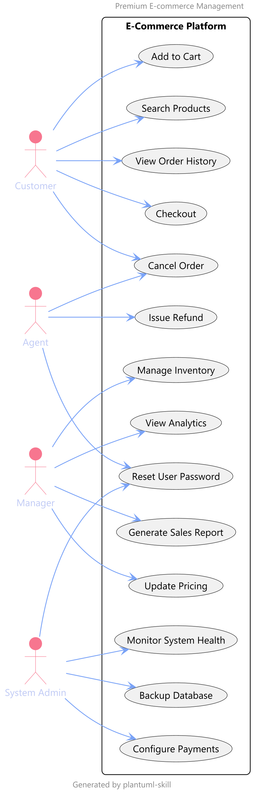
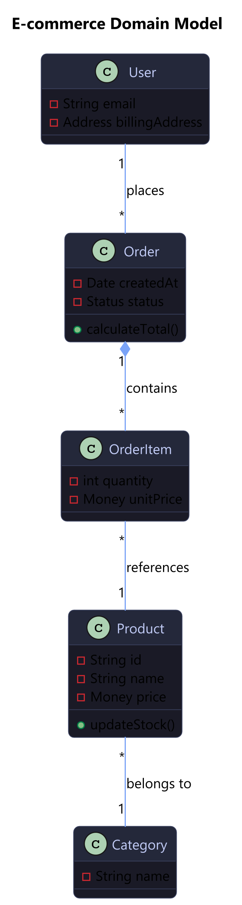
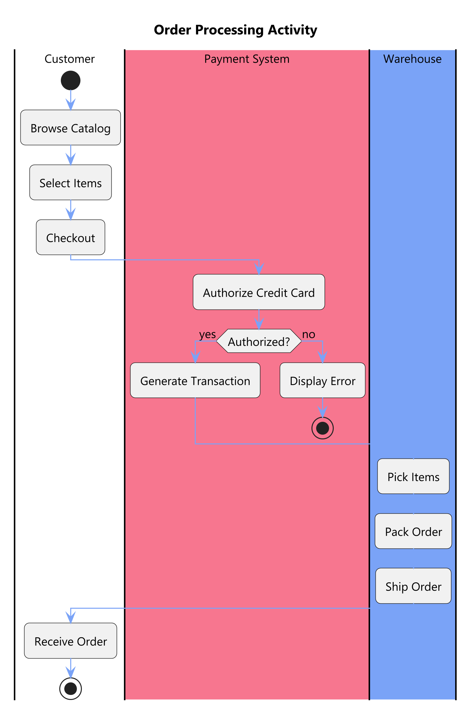
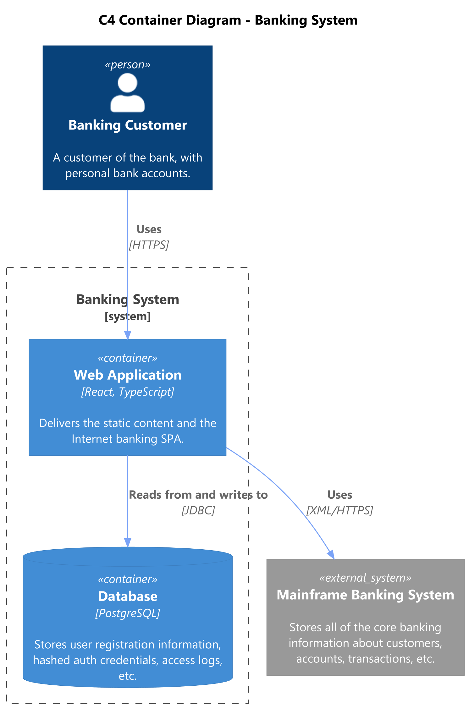
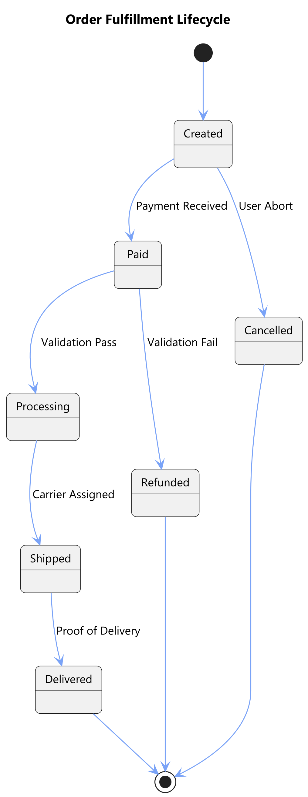
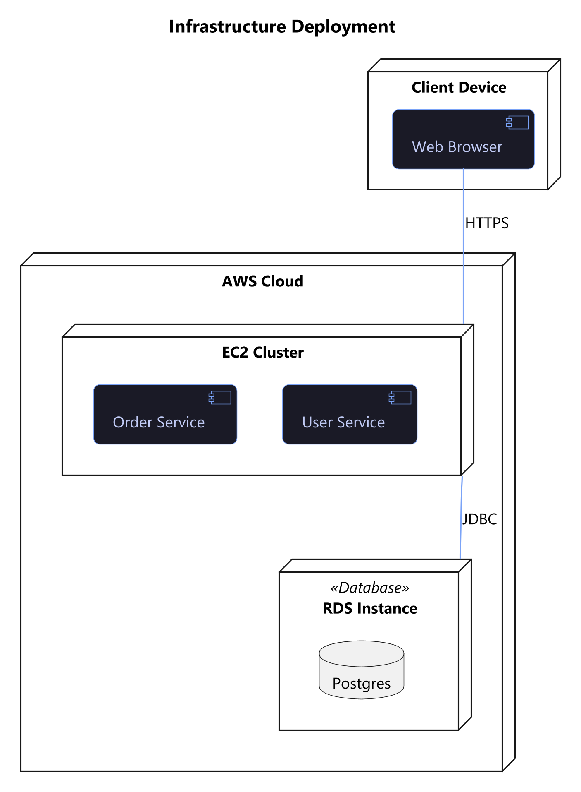
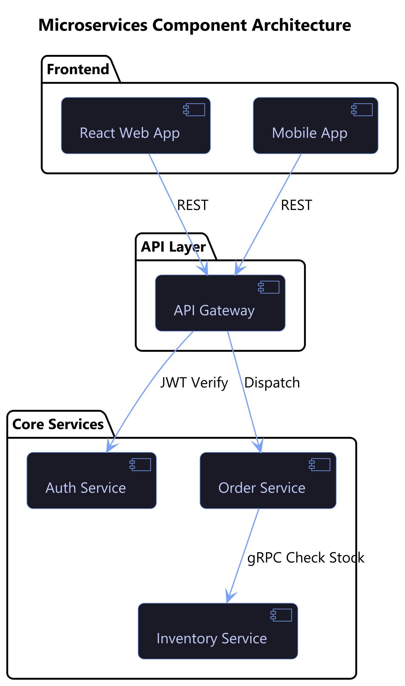
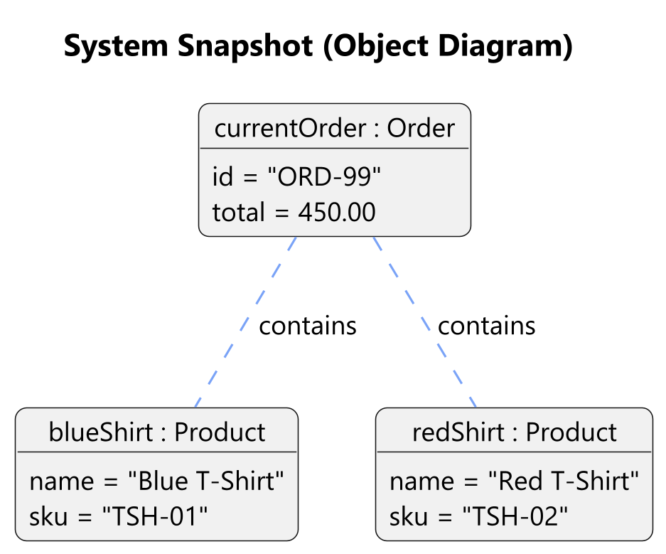
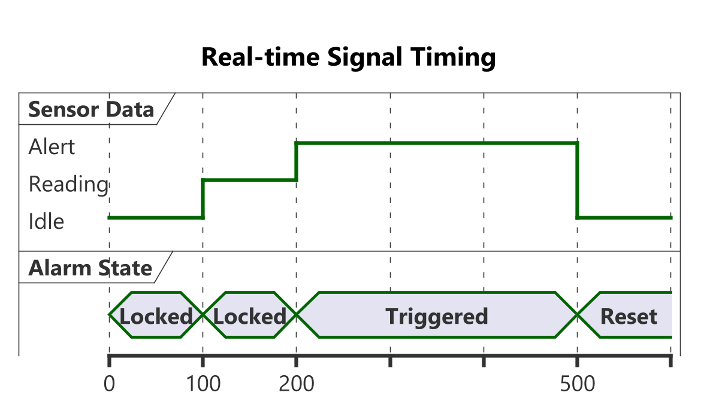

# PlantUML Professional Skill (v2.0)

[](https://github.com/jovd83/PlantUML-skill/actions/workflows/ci.yml)
[](CHANGELOG.md)
[](LICENSE)
[](CONTRIBUTING.md)
[](https://buymeacoffee.com/jovd83)

## 📖 Overview
`plantuml-skill` is an enterprise-grade agentic engine for rendering professional PlantUML and C4 diagrams. It enables high-fidelity "Diagrams as Code" with modern aesthetics and autonomous dependency management.

## 🌟 Key Features (v2.0)
- **Contract-Driven**: Explicit Input/Output JSON schemas in [SKILL.md](SKILL.md).
- **Self-Healing**: Autonomous provisioning via [scripts/render.py](scripts/render.py).
- **Premium Aesthetics**: Built-in "Tokyonight" theme for consistent output.
- **CI Validated**: Automated structural checks via GitHub Actions.

## 🛠 Prerequisites
The skill features a **self-healing setup script**, but generally requires:
1.  **Java (JRE 8+):** Required to run the PlantUML core.
2.  **Graphviz (dot):** Required for all structural diagrams (Class, Use Case, etc.).

## 📥 Installation
```bash
npx skills add https://github.com/jovd83/PlantUML-skill --skill plantuml-skill
```

## 🎨 Visual UML Gallery

### 1. Sequence Diagram


### 2. Use Case Diagram


### 3. Class Diagram (Domain Model)


### 4. Activity Diagram


### 5. C4 Container Diagram


### 6. State Machine


### 7. Deployment Diagram


### 8. Component Diagram


### 9. Object Diagram


### 10. Timing Diagram


---

## 📚 Documentation & Support
- [Syntax Guide](docs/syntax-guide.md): Standard notation and C4 library URLs.
- [Troubleshooting](docs/troubleshooting.md): Recovery steps for environment issues.
- [Changelog](CHANGELOG.md): Project evolution and version history.
- [Contributing](CONTRIBUTING.md): Guidelines for extending the skill.

---

**Developed for the AgentSkills.io Ecosystem.**
